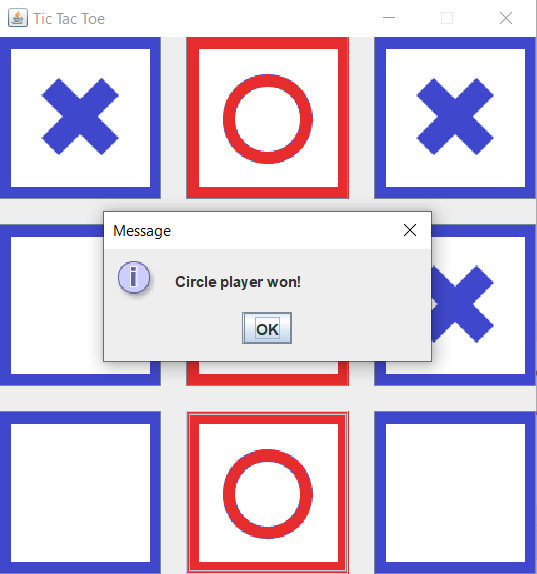

# TicTacToe
It's a simple **Tic Tac Toe game with GUI** written in Java. I divided app into: Model, View and Controller. I wrote a **specification** for this application - You can find it in repository root directory. I've also learned how to  write simple unit tests. 
## Technologies
* Java 8
* Maven
* JUnit 5

## Screenshots

